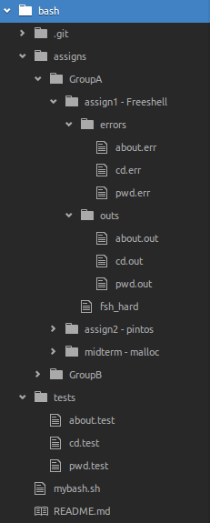

# bash-test
You may need to change following values before running the script

`test_dir`: holds tests to run assignments against

`assign_dir`: holds submitted assignments

`out_dir`/`err_dir`: each assignment will have its own directory for every test output and error

### how to write test
You are free to create temporary resources while running the test script. But clean up your shit before test execution finishes. Do not redirect the __test script__ and __'executable under test'__ stdout/stderr from parent process. In any case return status code.

